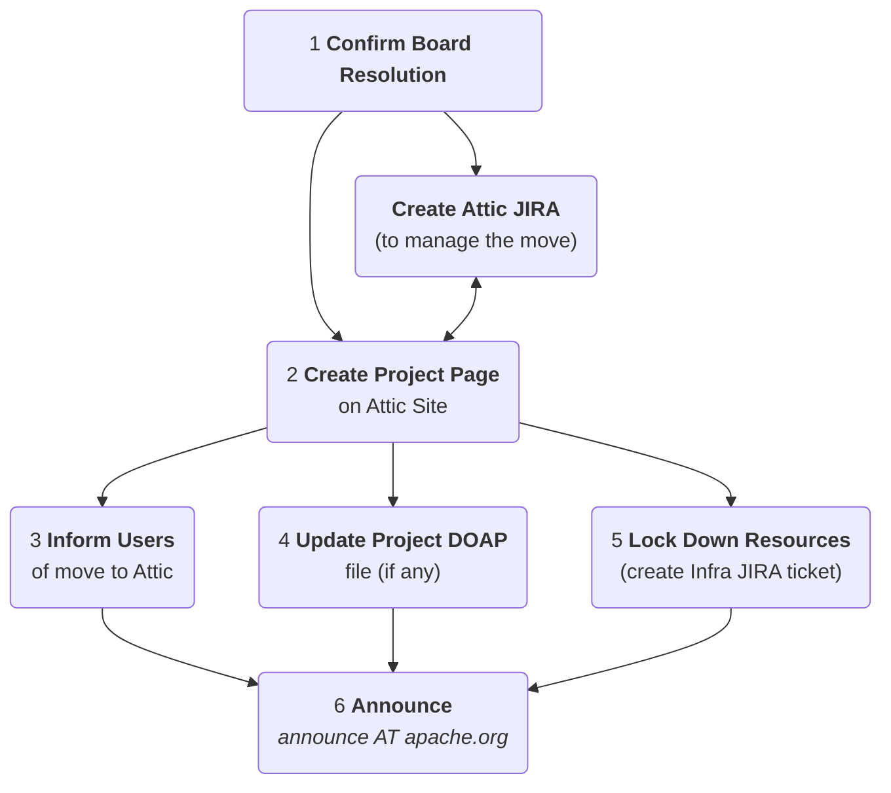
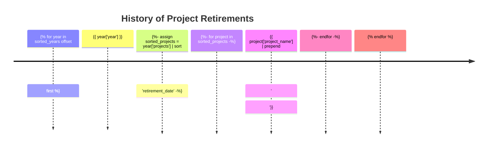


Licensed to the Apache Software Foundation (ASF) under one or more
contributor license agreements.  See the NOTICE file distributed with
this work for additional information regarding copyright ownership.
The ASF licenses this file to you under the Apache License, Version 2.0
(the "License"); you may not use this file except in compliance with
the License.  You may obtain a copy of the License at

http://www.apache.org/licenses/LICENSE-2.0

Unless required by applicable law or agreed to in writing, software
distributed under the License is distributed on an "AS IS" BASIS,
WITHOUT WARRANTIES OR CONDITIONS OF ANY KIND, either express or implied.
See the License for the specific language governing permissions and
limitations under the License.


# Experimental Page
***
This branch has a number of changes, for consideration:
 1. **Splitting** the Projects / Sub-Projects  into separate **lists** & **Navigation**(Sidebar)
   - [Retired Projects](projects.html)
   - [Retired Sub-Projects](subprojects.html)
 1. A [Project Index](projects-index.html) page
 1. This page showing [Mermaid Diagrams](https://just-the-docs.com/docs/ui-components/code/#mermaid-diagram-code-blocks):
   - [Attic Process Diagram](#attic-process-diagram)
   - [Project Retirements Graph](#project-retirements-graph)
   - [Project Retirements Timeline](#project-retirements-timeline)
   
## Attic Process Diagram



## Project Retirements Graph

The following graph shows the number of Projects retiring for each year (**NOT** including **Sub-Projects**).







    


{: .note}
This is currently configured to show the last **{{ no_of_years}} years** of retirements (easily changed through the `$no_of_years` variable).

```mermaid
xychart-beta
    title "Project Retirements by Year"
    x-axis "Year" [{{ sorted_years[first]['year']}}
     
       {{ year['year'] | prepend: ', '}}
     ]
    y-axis "Number of Projects" 0 --> {{count_max | plus: 2 | at_least: 10}}
    bar [{{ sorted_years[first]['p_count']}}
     
       {{ year['p_count'] | prepend: ', '}}
     ]
    line [{{ sorted_years[first]['p_count']}}
     
       {{ year['p_count'] | prepend: ', '}}
     ]
```

## Project Retirements Timeline
The following timeline shows Projects retiring for each year (including Sub-Projects, if any).




{: .note}
This is currently configured to show the last **{{ no_of_years}} years** of retirements (easily changed through the `$no_of_years` variable).

